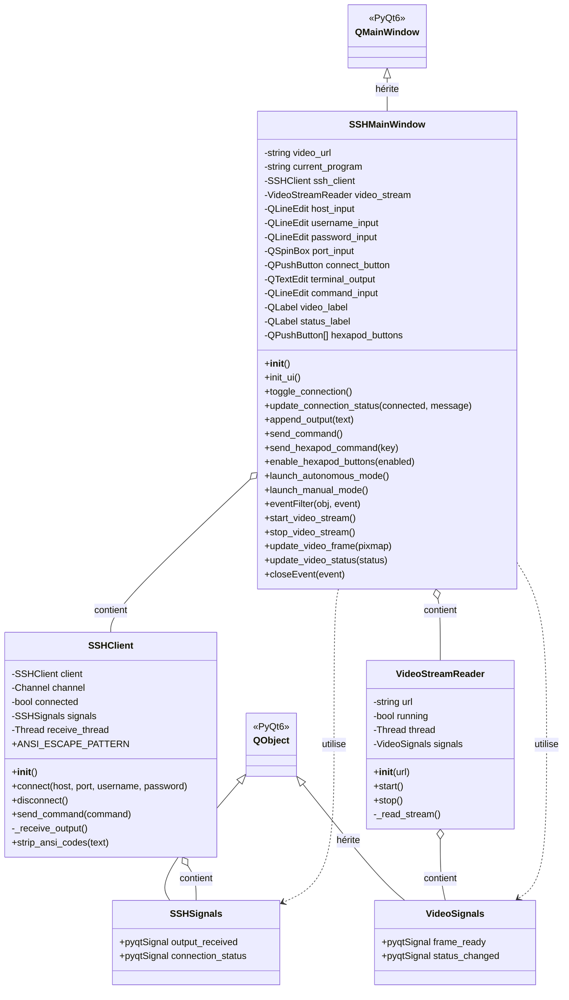

# Diagramme des Classes - SSH GUI Hexapode

## Architecture du Projet

Ce document présente l'architecture du projet SSH GUI pour le contrôle d'hexapode.

### Diagramme UML



## Description des Classes

### Classes de Signaux (PyQt6)

#### SSHSignals
Gère les signaux PyQt pour la communication SSH entre threads.

**Signaux** :
- `output_received(str)` : Émis quand des données sont reçues du serveur SSH
- `connection_status(bool, str)` : Émis lors d'un changement d'état de connexion

#### VideoSignals
Gère les signaux PyQt pour le streaming vidéo.

**Signaux** :
- `frame_ready(QPixmap)` : Émis quand une nouvelle frame vidéo est disponible
- `status_changed(str)` : Émis lors d'un changement d'état du flux vidéo

### Classes Métier

#### SSHClient
Gère la connexion SSH avec le Raspberry Pi via paramiko.

**Attributs** :
- `client` : Client SSH paramiko
- `channel` : Canal shell interactif
- `connected` : État de la connexion
- `signals` : Instance de SSHSignals
- `receive_thread` : Thread de réception des données
- `ANSI_ESCAPE_PATTERN` : Pattern regex pour nettoyer les codes ANSI

**Méthodes** :
- `connect()` : Établit la connexion SSH et lance le thread de réception
- `disconnect()` : Ferme la connexion SSH
- `send_command()` : Envoie une commande au serveur
- `_receive_output()` : Reçoit les données SSH (exécuté dans un thread)
- `strip_ansi_codes()` : Supprime les codes d'échappement ANSI du texte

#### VideoStreamReader
Lit et décode les flux vidéo MJPEG via HTTP.

**Attributs** :
- `url` : URL du flux MJPEG
- `running` : État du lecteur
- `thread` : Thread de lecture du flux
- `signals` : Instance de VideoSignals

**Méthodes** :
- `start()` : Démarre la lecture du flux dans un thread
- `stop()` : Arrête la lecture du flux
- `_read_stream()` : Lit et parse le flux MJPEG (exécuté dans un thread)

#### SSHMainWindow
Fenêtre principale de l'application Qt, gère toute l'interface utilisateur.

**Attributs** :
- `ssh_client` : Instance de SSHClient
- `video_stream` : Instance de VideoStreamReader
- `current_program` : Programme hexapode en cours ('auto', 'manual', ou None)
- Widgets Qt : inputs, boutons, labels, terminal, etc.

**Méthodes principales** :
- `init_ui()` : Construit l'interface utilisateur
- `toggle_connection()` : Gère connexion/déconnexion SSH
- `send_hexapod_command()` : Envoie commandes de contrôle hexapode
- `launch_autonomous_mode()` : Lance navigation_autonome.py
- `launch_manual_mode()` : Lance deplacement.py
- `eventFilter()` : Capture les raccourcis clavier
- `start_video_stream()` : Démarre le flux vidéo
- `update_video_frame()` : Affiche une nouvelle frame vidéo

## Relations entre Classes

### Héritage
- `SSHSignals` et `VideoSignals` héritent de `QObject` (PyQt6)
- `SSHMainWindow` hérite de `QMainWindow` (PyQt6)

### Composition (contient)
- `SSHClient` contient une instance de `SSHSignals`
- `VideoStreamReader` contient une instance de `VideoSignals`
- `SSHMainWindow` contient une instance de `SSHClient`
- `SSHMainWindow` contient une instance de `VideoStreamReader`

### Utilisation
- `SSHMainWindow` se connecte aux signaux de `SSHSignals` et `VideoSignals`

## Flux de Communication

### Connexion SSH
```
SSHMainWindow → SSHClient.connect()
    → Thread de réception démarre
    → SSHSignals.connection_status émis
    → SSHMainWindow.update_connection_status() appelé
```

### Réception de données SSH
```
SSHClient._receive_output() (thread)
    → SSHSignals.output_received émis
    → SSHMainWindow.append_output() appelé
```

### Streaming vidéo
```
SSHMainWindow → VideoStreamReader.start()
    → Thread de lecture démarre
    → VideoStreamReader._read_stream() (thread)
    → VideoSignals.frame_ready émis
    → SSHMainWindow.update_video_frame() appelé
```

### Contrôle hexapode
```
Utilisateur appuie sur touche
    → SSHMainWindow.eventFilter() capture
    → SSHMainWindow.send_hexapod_command()
    → SSHClient.channel.send()
```

## Configuration

Le fichier `config.py` centralise toutes les constantes de configuration :
- URL du flux vidéo
- Dimensions de la fenêtre
- Commandes des programmes hexapode
- Mapping des touches de contrôle
- Délais et timeouts

## Point d'entrée

Le fichier `main.py` instancie `SSHMainWindow` et démarre l'application Qt.

```python
app = QApplication(sys.argv)
window = SSHMainWindow()
window.show()
sys.exit(app.exec())
```
